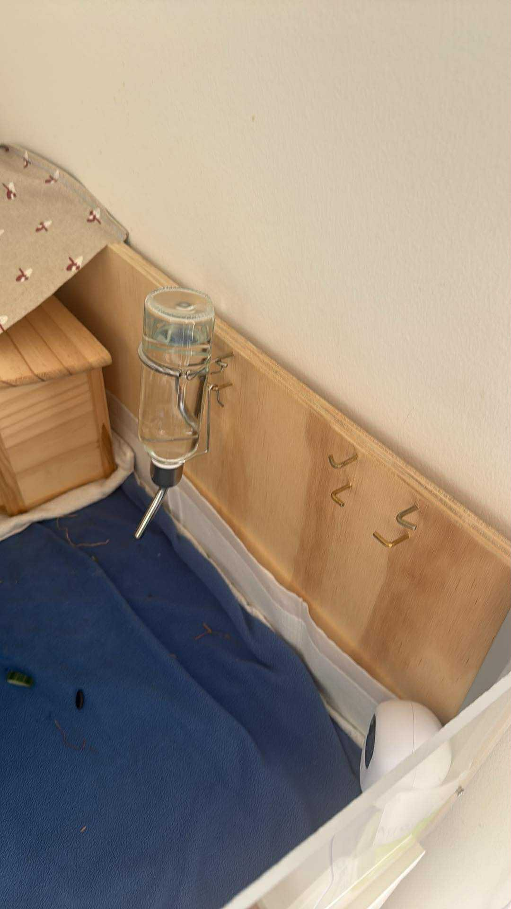
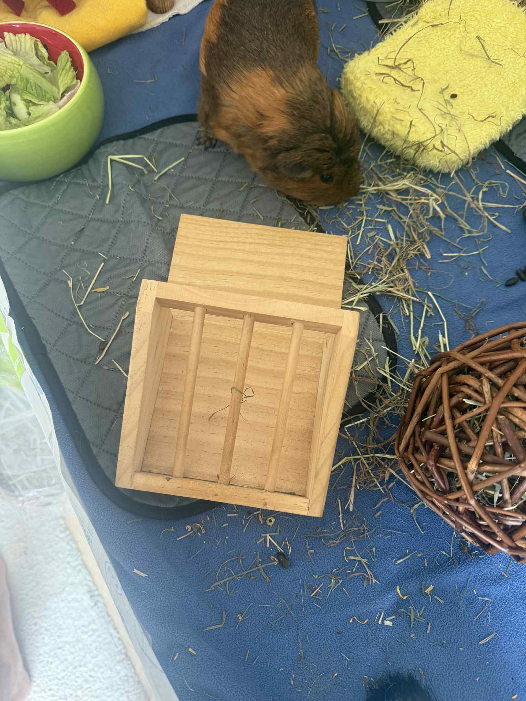
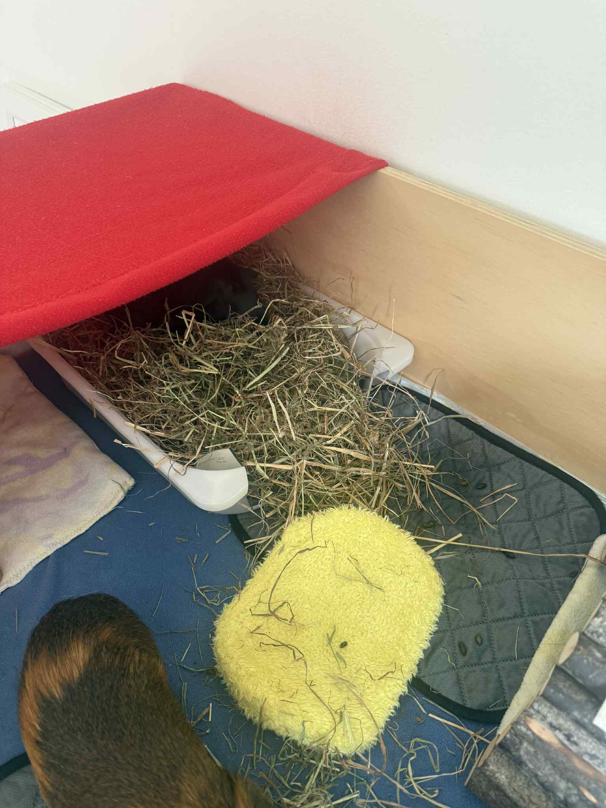
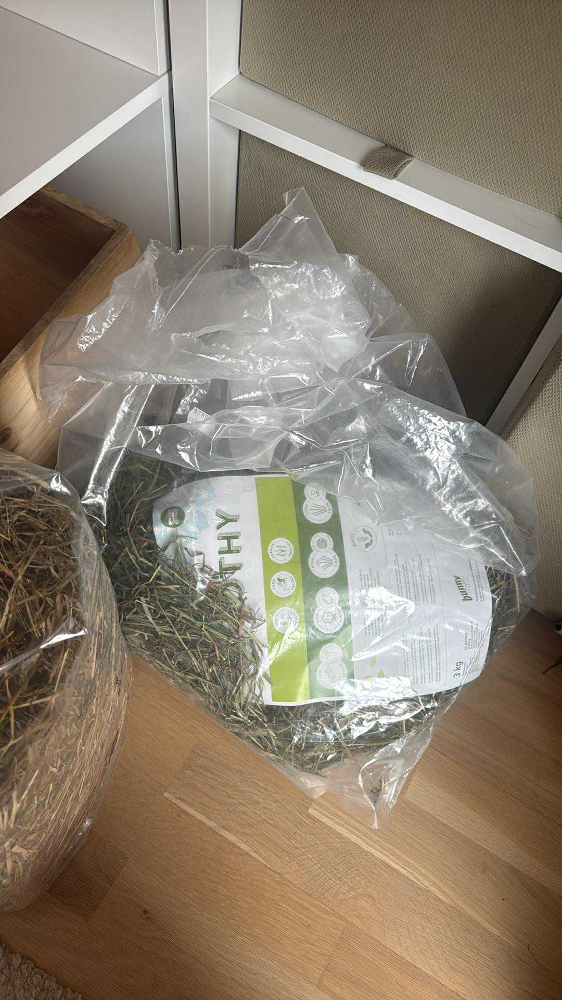
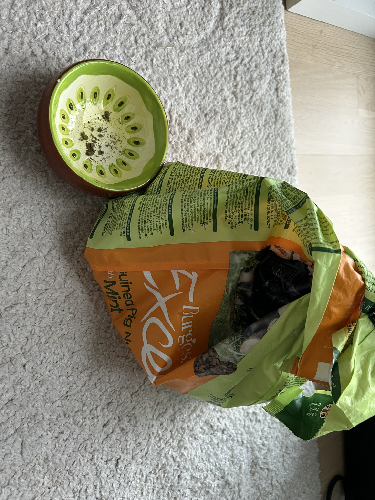

# Guine pigs maintenance guide :)
## Prerequisites
* Grab a bowl with veggies from the fridge (warning: if you make a tapping sound on the bowl while going upstairs they might queek at you, but it is because they are always hungry)
* Grab water bottle from Sandra's desk (right next to the fastest PC ever)

## Veggies
Place bowl with veggies in the cage.

## Water
Hang the bottle of water on the wall mount.

## Hay
1. Put fresh Timothy hay from bag on into the container and top up the litter box with more fresh hay.

2. Put the container with new hay back to the cage.

## Pellets
1. Fill the kiwi bowl with pellets from the green bag and give it to the piggies.

Donee! :) 
